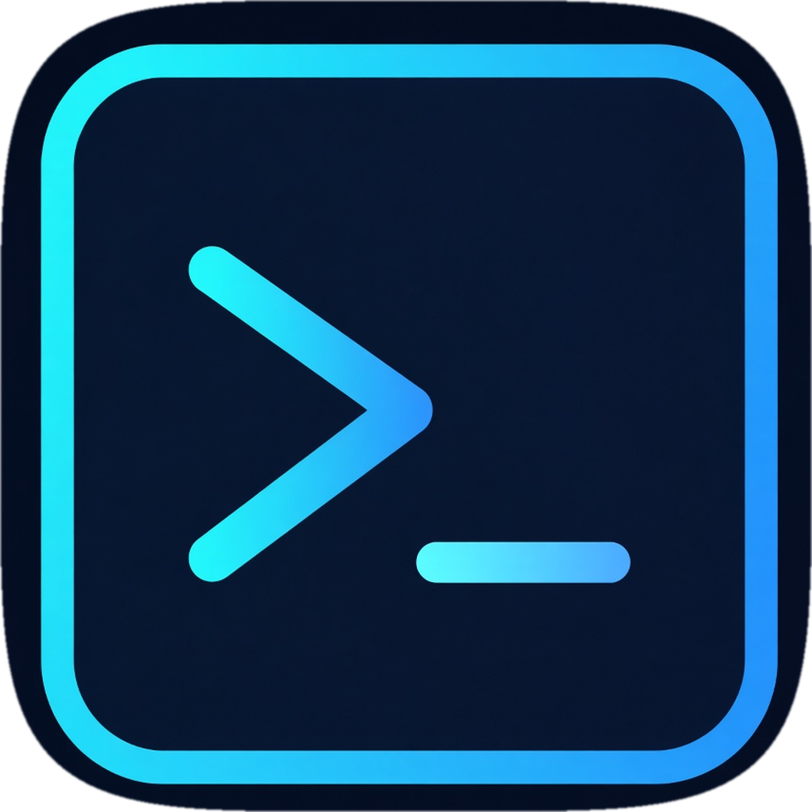

<h1 align="center">
  
  <br />
  FuturaTerm
</h1>

<p align="center">
  A native macOS terminal that keeps your projects, panes, and remote shells alive.
</p>

<p align="center">
  
</p>

<p align="center">
  <a href="https://futuraterm.com"><b>Website</b></a> ·
  <a href="https://futuraterm.com/docs"><b>Docs</b></a> ·
  <a href="https://github.com/davidsolheim/futuraterm"><b>Source</b></a>
</p>

FuturaTerm is a single-window SwiftUI app on libghostty. The workspace is a vertical project sidebar: local folders, SSH hosts, tabs, splits, and pinned sessions that start with the app. Quit, sleep, or lose the network and local shells detach instead of dying; remote shells stay on the host. Relaunch reattaches them, scrollback included.

It reads your existing Ghostty config — theme, font, keybinds — and ships a `futuraterm` CLI so scripts and agents can split panes, type into them, and apply layouts.

## Highlights

- **Sessions that outlive the window** — zmx holds each pane. Closing FuturaTerm detaches; opening it reattaches.
- **Projects, including remote ones** — a sidebar row is a directory, local or `[user@]host:path`. Remote panes persist on that machine.
- **Pinned tabs** — stay running above your projects, restore their command if the session dies, and live in an editable `pinned.yaml`.
- **YAML layouts** — declare tabs, splits, cwd, and `run:` / `shell:` per pane under `~/.config/futuraterm/projects/`.
- **Palette and CLI** — <kbd>⌘P</kbd> for actions and directories; `futuraterm pane` / `tab` / `layout` for everything you can click.
- **Quick terminal** — a global drop-down on <kbd>⌃`</kbd> for scratch work outside the project sidebar.

## Build

Requires macOS 26+ and full Xcode 26 to compile. The app runs on macOS 14+.

```bash
git clone https://github.com/davidsolheim/futuraterm.git
cd futuraterm
mise install
mise run setup
mise run run
```

`mise run run` launches **FuturaTermDebug.app** (Dock name **FuturaTerm Debug**, bundle `com.davidsolheim.futuraterm.debug`), which uses its own Application Support directory. Release stays **FuturaTerm.app**.

Install a Release build to `/Applications/FuturaTerm.app` with `mise run build` then `mise run install`. Auto-update is disabled.

The control CLI inside a pane is `futuraterm`. Another Mac app (Grok Bot) should call the nested `Contents/Resources/bin/futuraterm` — see **Automation from another Mac app (Grok Bot)** in `AGENTS.md` and `scripts/grok-bot-handoff.sh`. Project YAML lives in `~/.config/futuraterm/projects/`.

## Repositories

Three repos. Not a monorepo.

| Repo | Visibility | Role |
| --- | --- | --- |
| [davidsolheim/futuraterm](https://github.com/davidsolheim/futuraterm) | public | This tree: MIT source, tests, `mise run build`. |
| [teton-web/futuraterm](https://github.com/teton-web/futuraterm) | private | Working clone and **signed releases**. Developer ID, notarization, Sparkle private key. Signing certs live in Doppler `teton-certs`. |
| [teton-web/futuraterm-com](https://github.com/teton-web/futuraterm-com) | private | [futuraterm.com](https://futuraterm.com). |

A public tag is source. The notarized DMG is built on the private app repo and attached to the public GitHub Release. Do not put the website in this tree, do not fold the app into the site, and do not run Apple signing on the public Actions account.

## License

MIT. Copyright (c) 2026 FuturaTerm. Portions derived from MacTerm, MIT, Copyright (c) 2026 Macterm. Bundled Ghostty (libghostty) is MIT, Copyright (c) 2024 Mitchell Hashimoto, Ghostty contributors. Bundled zmx is MIT, Copyright (c) 2025 Eric Bower. See `LICENSE`.
