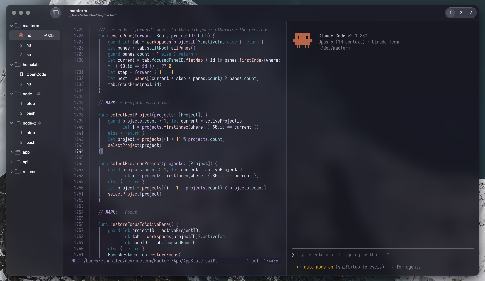

<h1 align="center">
  
  <br />
  FuturaTerm
</h1>

<p align="center">
  A macOS terminal with session persistence, smart multiplexing, and a native project sidebar. Built on libghostty.

</p>

<p align="center">
  
</p>



## Features

- **Persistent multiplexing** \
  Projects, tabs, and split panes are saved and restored on relaunch. Quitting detaches your shells; relaunching brings them back with scrollback and running processes intact.
- **Remote projects** \
  Open a directory on another machine over SSH. Your shells keep running there, surviving quits, dropped connections, and even a local reboot.
- **Vertical project sidebar** \
  Organize projects and their tabs in a native macOS sidebar, stacked vertically where there's room to read them.
- **Pinned tabs** \
  Pin a tab above your projects to keep it running: it starts on every launch, and restores itself with its command if the session dies.
- **Command palette** \
  Press <kbd>⌘P</kbd> to split panes, switch projects, or open a directory. Every action is a keystroke away, and each row shows its keybind.
- **Declarative layouts** \
  Describe a project's tabs, splits, and per-pane commands in YAML; FuturaTerm builds the workspace from it on open.
- **Control CLI** \
  A bundled `futuraterm` command drives the running app, so scripts and AI agents can spawn panes, run commands, and script layouts.
- **Quick terminal** \
  A global drop-down terminal on a hotkey (<kbd>⌃`</kbd>), for scratch work from anywhere.
- **Ghostty compatibility** \
  Reads your existing Ghostty config. Theme, font, keybinds: all of it just works.

## Build

Requires macOS 26+ and full Xcode 26 to build. The app itself runs on macOS 14+.

```bash
git clone https://github.com/davidsolheim/futuraterm.git
cd futuraterm
mise install
mise run setup
mise run run
```

`mise run run` launches **FuturaTerm Debug**, which uses its own bundle ID and Application Support directory.

Install a Release build to `/Applications/FuturaTerm.app` with `mise run build` then `mise run install`. Auto-update is disabled.

The control CLI inside a pane is `futuraterm`. Project YAML lives in `~/.config/futuraterm/projects/`.

## License

MIT. Copyright (c) 2026 FuturaTerm. Bundled Ghostty (libghostty) is MIT, Copyright (c) 2024 Mitchell Hashimoto, Ghostty contributors. Bundled zmx is MIT, Copyright (c) 2025 Eric Bower. See `LICENSE`.
